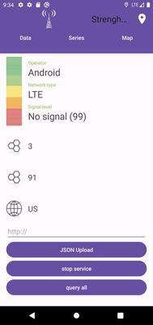

# Signal Strength
Purpose of this project is to calculate *signal strength* based on locations. After that we utilize that data to draw statistics plot from it. and we also show coverage of *signal strength* map in different geographic location.

## folder structure
this project has been implemented in structural way. explaination of each subpart is mentioned breifly in the following items: 
* **res** : In fact its short form of resource that contains static data such as *layouts, strings, images*.
layout files are representing the design of application in *xml* format. strings and images are descriptive data of our application. 
* **main** : this part is major implementation of our project. that has been structured into other subparts.
    * telephony : all things that are needed for collecting and gathering data information about Signal Strength and user Info its has been accomplished by this java module. In fact Android has helped us through this gathering. for example recognizing network type is *LTE* or defining *no signal* are handled with this module.
    * controller : this parts contains mostly location tasks which is receiving the current location, managing the current position, and any update in the location are register via *TrakingManager* file.
    * model : contains two model that one of them is *PinPoint* model that store information on every things that will be needed such as *latitude, longtitude, networkType, track and etc.* the other model is *PinPoint* that stores *id* of user and the *startDate* to collect data and signal strength.  
    * presentation : this module handles data fragmentation and UI update and tasks like that such as when mobile resumed to collect data it will update the signal strength and then UI will get updated. And it controls the main buttons on first tab logics. our buttons are *json upload, stop service, query all*.
    * db : we are using *room* database for collecting our data. every data that has been collected from running this app has been saved in our database. this module describes CRUD functions and functions such as data convertor.
    * di : its dependency injection it wil initializes our *tracking* and *telephony* module.
    * dagger : we also used dagger to encapsulate and provide objects in a semantic way.

## Saving And Visualizing Data
As mentioned above, we're using [Room Database](https://developer.android.com/training/data-storage/room) and every data which are collected during working with application are saved via this database.
example of using Room Databae : 
```
import androidx.room.Database
import androidx.room.RoomDatabase
import androidx.room.TypeConverters
import com.shnaseri.strenghmap.model.PinPoint

@TypeConverters(DateConverter::class)
@Database(entities = [PinPoint::class], version = 1)
abstract class AppDatabase : RoomDatabase() {
    abstract fun pinPointDao(): PinPointDao
}

```
But unfortunately we couldn't depict a visualized picture from our saved data.

## Application Output
we provided 3 tabs as below image. but we didn't afford to test the second and the third tab. 
But first tab displays current data about signal strength and network information such as the network generation you're connected to. that in this picture is *LTE*.


But about showing circles on map that represents signals strength on each location collected through our application, all things that needed to be implemented inside code has been done completely. But since google map didn't provide their API freely and for consuming tokens we had to make a payment for that in paypal and we couldn't do that. but the code for filling out API key is shown below, so if you provide API key it will displays map correctly.  


     